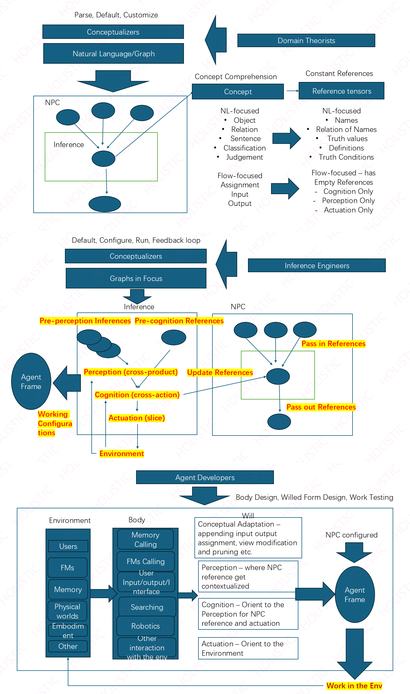

# Norm-based Plan in Concepts (NPC)

NPC is a system designed to enhance AI foundation models by explicitly separating and enforcing norms and task settings. It provides a structured approach to ensure AI systems operate within defined norms while maintaining flexibility for specific task scenarios.

## Core Features

- **Explicit Norm Encoding**: Structurally enforced norms for increased robustness and verifiability
- **Dynamic Adaptability**: Norm graphs can be updated without retraining
- **Collaborative Governance**: Combines expert domain knowledge with AI scalability

## Architecture

The NPC system consists of four core components and operates across multiple layers:



### Core Components

1. **Concepts**: Fundamental building blocks representing different types of conceptual entities
   - NL-focused: Objects, Relations, Sentences, Classifications, Judgements
   - Flow-focused: Assignment, Input, Output

2. **References**: Tensor-like data structures that organize and store concept instances
   - NL-focused: Names, Relation of Names, Truth values, Definitions, Truth Conditions
   - Flow-focused: Empty References (Cognition, Perception, Actuation Only)

3. **Inferences**: Define and manage relationships between concepts
   - Pre-perception Inferences
   - Pre-cognition References
   - Perception (cross-product)
   - Cognition (cross-action)
   - Actuation (slice)

4. **Plan**: The final executable object that combines concepts and inferences
   - Pass in References
   - Update References
   - Pass out References

### Development Layers

1. **Domain Theorists**: Define the conceptual foundation
2. **Conceptualizers**: Parse, Default, Customize through Natural Language/Graph interfaces
3. **Inference Engineers**: Configure and run feedback loops using Graphs in Focus
4. **Agent Developers**: Implement Body Design, Willed Form Design, and Work Testing

### Agent Framework Integration

The NPC system integrates with the Agent Framework through:
- **Environment Interface**: Users, FMs, Memory, Physical worlds
- **Body Components**: Memory Calling, FMs Calling, I/O Interface, Searching
- **Will System**: Conceptual Adaptation, Perception, Cognition, Actuation

## Installation

1. Clone the repository:
```bash
git clone https://github.com/Xin-Guan-HolisticAI/npc_agent.git
cd npc_agent
```

2. Create and activate a virtual environment:
```bash
python -m venv .venv
source .venv/bin/activate  # On Windows: .venv\Scripts\activate
```

3. Install dependencies:
```bash
pip install -r requirements.txt
```

## Usage

[Usage instructions will be added here]

## Project Structure

- `core/`: Contains the main implementation of the NPC system
  - `_agentframe/`: Agent framework implementation
  - `_conceptualizers/`: Concept parsing and management
  - `_npc_components/`: Core NPC system components
- `example/`: Example implementations and use cases
- `example_workflow.md`: Detailed documentation of the system's workflow
- `docs/`: Documentation and architecture diagrams

## Contributing

Contributions are welcome! Please feel free to submit a Pull Request.

## License

[License information will be added here] 